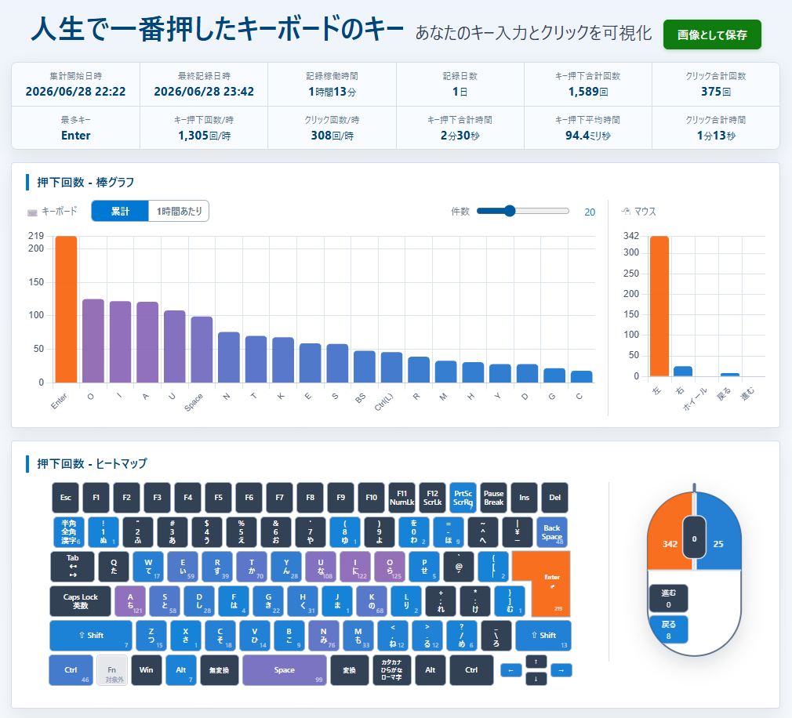

# KeyCounter

キーボードとマウスの押下回数・押下時間を可視化する Windows 常駐アプリです。



## 特徴

- キー別の押下回数をランキングと棒グラフで表示
- 日本語配列キーボード風のヒートマップ表示
- マウスの左クリック、右クリック、ホイールクリック、戻る・進むボタンを集計
- 押下時間の合計・平均・最大値を記録
- 集計開始、最終記録、記録稼働時間、1時間あたりの操作ペースを表示
- 統計画面を画像として保存
- タスクトレイに常駐し、一時停止、手動保存、リセット、起動時実行を操作可能

## ダウンロード

最新版は以下のページからダウンロードできます。

https://bunjicompany.com/downloads/KeyCounter/

## 保存するデータ

保存するもの:

- キー/マウスボタンの識別子
- 押下回数
- 合計押下時間
- 最大押下時間
- 初回記録日時・最終記録日時
- 記録稼働時間

保存しないもの:

- 入力文字列
- パスワード
- クリップボード内容
- 押下順序・時系列ログ
- マウス座標

アプリ版の統計は `%LOCALAPPDATA%\KeyCounter\keys_stats.json` に保存されます。

## 開発環境

```powershell
python -m venv .venv
.\.venv\Scripts\python.exe -m pip install -r requirements.txt
```

## 実行

開発中に直接起動する場合:

```powershell
.\.venv\Scripts\python.exe keycounter_app.py
```

記録ロジックだけをコンソールで動かす場合:

```powershell
.\.venv\Scripts\python.exe key_tracker.py
```

## ビルド

```powershell
.\build_keycounter.ps1
```

ビルドすると、以下が作成されます。

- `release-package\yyyyMMdd-HHmmss\KeyCounter\KeyCounter.exe`
- `dist\KeyCounter.zip`

## ライセンス

MIT License
